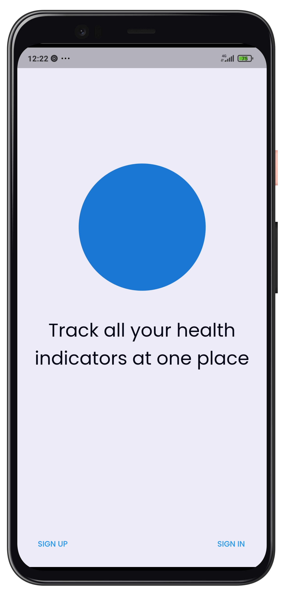
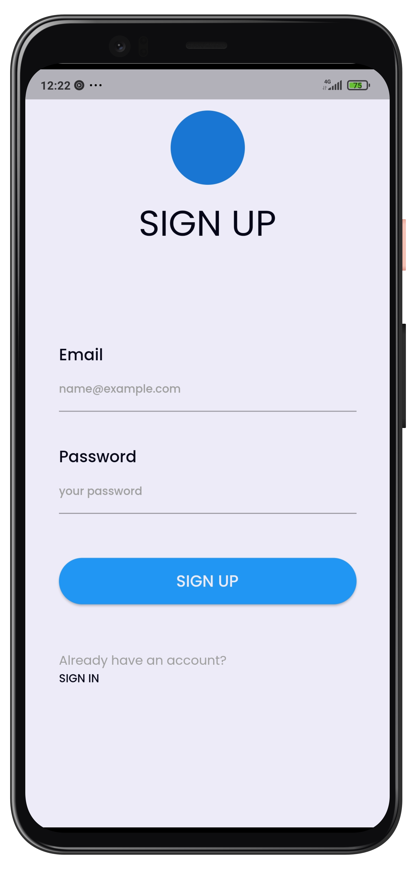
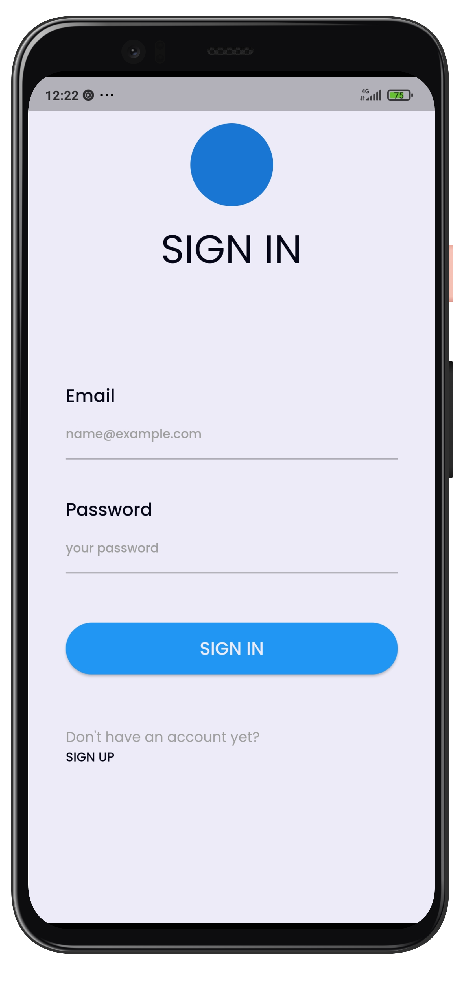
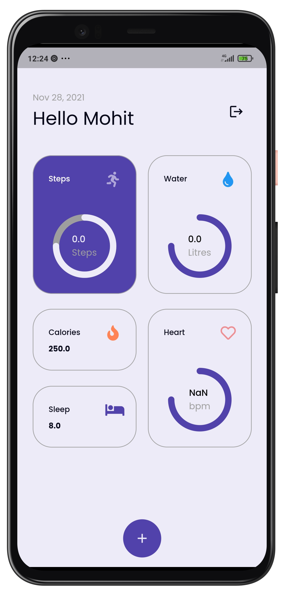
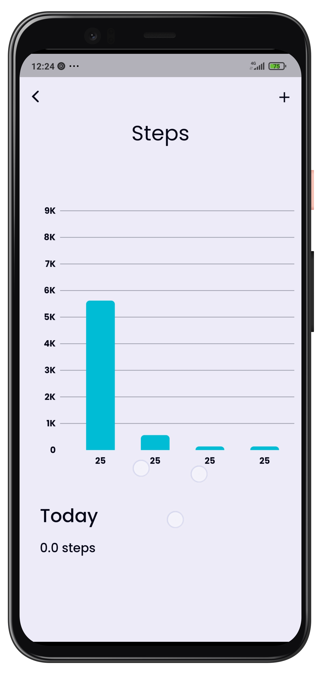
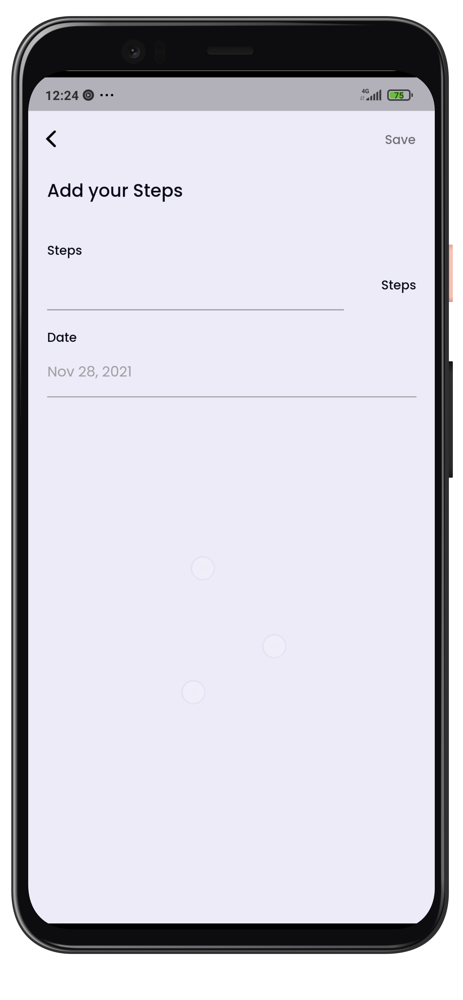
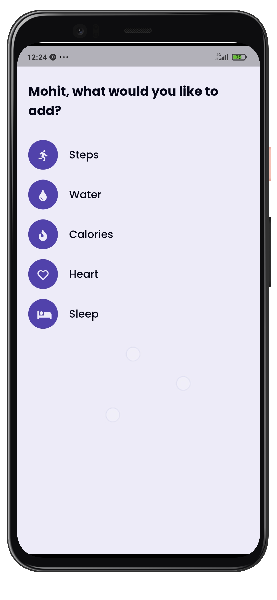

# Health

A Flutter Application to keep track of your health indicators.

## Getting Started

You can directly install the apk file from [releases](https://github.com/MrUnfunny/health_app/releases).

## App Screens

<p>

<p>
</p>

</p>

</p>

#### Building from source

If you do not have the Flutter SDK installed, follow the instructions from the
Flutter site [here](https://flutter.dev/docs/get-started/install).

To build from source clone the repository:

```
git clone https://github.com/MrUnfunny/health_app.git
```

Get the dependencies by running this command inside the project directory:

```
flutter packages get
```

Then either run this command to run the app in device:

```
flutter run
```

Or build the apk using this command:

```
flutter build apk
```

#### 🔌 Plugins

| Name                                                                  | Usage                            |
| --------------------------------------------------------------------- | -------------------------------- |
| [**flutter_bloc**](https://pub.dev/packages/flutter_bloc)             | State Management                 |
| [**firebase_auth**](https://pub.dev/packages/firebase_auth)           | For firebase authentication      |
| [**cloud_firestore**](https://pub.dev/packages/cloud_firestore)       | For Firestore                    |
| [**firebase_analytics**](https://pub.dev/packages/firebase_analytics) | For google analytics             |
| [**fl_chart**](https://pub.dev/packages/fl_chart)                     | To show bar graphs               |
| [**equatable**](https://pub.dev/packages/equatable)                   | To simplify equality comparisons |

### App Overview

This app aims to keep track of your health indicators such as weight, sleep, average heart rate, calories burnt etc.

This app is built in a modular way. So, new indicators can be easily added just by creating a new Indicator model and adding it to the Constant data of the app. Here, Firebase is used for authentication as well as a backend for storing data. Firebase Analytics has also been implemented to analyse app data via firebase.

### App Structure

The app is structured as follows:

```
/bloc
  /auth
  /firestore
  ... and more
/config
/constant
/models
/presentation
  /common
  /screens
/repository
/utils
```

**bloc** contains the state management layer used for communication between UI and repository. `auth` contains bloc related to authentication such as signin, signup and signout. `firestore` contains bloc related to handling firesore and api calls.

**config** contains common configuration used across the application.

**constant** contains routing information and common constant values such as strings.

**presentation** contains all the UI related code. `common` contains common UI widgets used across multiple screens. `screens` contains code for all different screens.

**repository** contains code for interacting with external servers and other tasks. It contains networking and other third party interactions.
